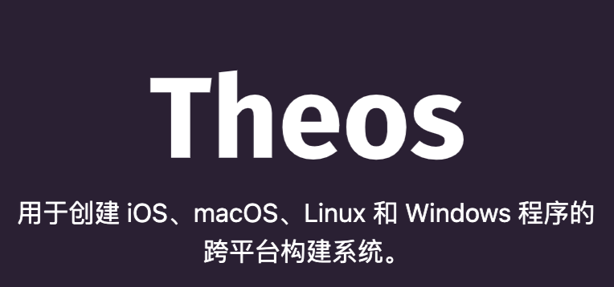
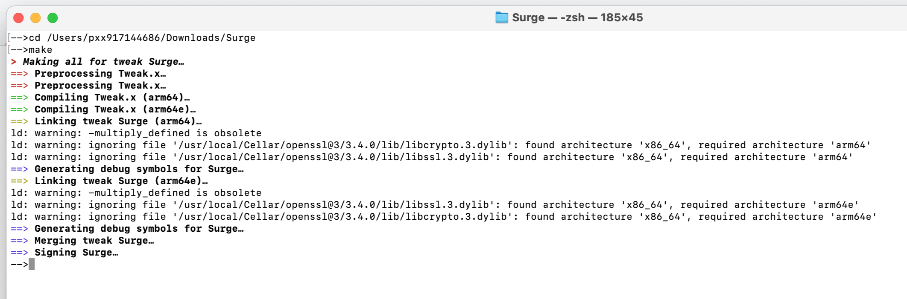

<!-- 图片部分 -->

    
    
    
    
    
    

<!-- Theos 图片与命令部分 -->
<table style="width: 100%;">
<tr>
<td style="padding-right: 20px; width: 50%;">
    
</td>
<td style="width: 50%; vertical-align: top;">
    <pre>

    终端执行 克隆 Theos 仓库
    git clone --recursive https://github.com/theos/theos.git

    将 Theos 的路径添加到环境变量中：
    方法一：
    终端执行 直接添加到 ~/theos

    export THEOS=~/theos
    export PATH=$THEOS/bin:$PATH

    终端执行 重新 加载配置：
    source ~/.zshrc

    另一种方法：
    终端执行 打开配置文件 .zshrc
    nano ~/.zshrc

    # Theos 配置  // theos文件夹 的本地路径
    export THEOS=/Users/pxx917144686/theos     

    之后；contron + X 是退出编辑； 按‘y’ 保存编辑退出！

    终端执行 重新 加载配置：
    source ~/.zshrc

</td>
</tr>
</table>

<!-- Theos 编译预览图片 -->

<!-- Theos 报错说明部分 -->

 👉  如果 theos 报错:ld: warning: -multiply_defined is obsolete 

| **theos报错** | **解释** |
|----------|----------|
| **报错** | ld: warning: -multiply_defined is obsolete |
| **解释** | 为什么会出现这个问题？ |
| **原因** | 新版本的 Apple 链接器 (ld64) 不再推荐使用 `-multiply_defined`；Theos 为了兼容旧版本 iOS，才默认加入该选项。 |
| **解决** | 在文件 `theos/makefiles/targets/_common/darwin_tail.mk` 打开文件，搜索找到并删除 `-multiply_defined suppress` |

<!-- make 报错说明部分 -->

 👉  如果 make 报错:found architecture 'x86_64', required architecture 

| **make报错**                           | **解释**                                                                                                                                                                                                                                                                         |
|------------------------------------|----------------------------------------------------------------------------------------------------------------------------------------------------------------------------------------------------------------------------------------------------------------------------------|
| **报错**                           | `warning: ignoring file '/usr/local/Cellar/openssl@3/3.4.0/lib/libcrypto.3.dylib': found architecture 'x86_64', required architecture 'arm64e'`                                                                                                                                |
| **解释**                           | 英特尔的Mac x86_64 不匹配架构 OpenSSL 库。                                                                                                                                                                                                            |
| **检查**                           | Mac 架构检查： - 在终端执行 `uname -m`  - 输出 `x86_64` 表示 Intel Mac - 输出 `arm64` 表示 Apple Silicon Mac                                                                                                                     |
| **解决（Intel x86_64 方法）**         | 避免耽误时间精力！网络指导可能产生误导，把 Intel (x86_64) 的方法误导为适用于 arm64 的方法。使用 Intel Mac 编译 iOS 插件时，目标架构应为 `arm64` 或 `arm64e`。                                                                                                    |
| **步骤一：下载 OpenSSL 官方源代码** | - 在终端执行：`git clone https://github.com/openssl/openssl.git`  - 进入目录：`cd openssl`                                                                                                                                                                                   |
| **步骤二：设置环境变量**             | - 执行：`export PLATFORM="iPhoneOS"`  - 执行：`export SDK=$(xcrun --sdk iphoneos --show-sdk-path)`  - 执行：`export CC="$(xcrun --sdk iphoneos -f clang)"`                                                                                                               |
| **设置支持多个架构**                | - 执行：`export ARCHS="arm64 arm64e"`  - 执行：`export CFLAGS="-arch arm64 -arch arm64e -isysroot $SDK -miphoneos-version-min=14.0"`  - 执行：`export LDFLAGS="-arch arm64 -arch arm64e -isysroot $SDK"`                                                  |
| **配置 OpenSSL 编译**              | 执行：`./Configure ios64-cross no-shared no-dso no-hw no-engine --prefix=$(PWD)/../openssl-ios`                                                                                                                                                                                  |
| **步骤三：编译 OpenSSL**            | - 清理缓存：`make clean`  - 编译 OpenSSL：`make`  - 安装 OpenSSL 到指定目录：`make install`                                                                                                                                                                               |
| **验证编译结果**                   | 在终端执行： - `lipo -info ../openssl-ios/lib/libcrypto.a`  - `lipo -info ../openssl-ios/lib/libssl.a`  成功的输出应显示：`arm64 arm64e`                                                                                                                               |

# 关于 解决 Surge 5.9.0 及以上版本模块403 验证机制

Surge 5.9.0 及以后版本使用 **License 校验** 来管理应用的授权。验证过程涉及与服务器的通信，检查设备信息、授权政策和签名校验。为确保授权有效性，Surge 会定期进行授权检查，包括 **refresh** 和 **verify** 请求。 

| 请求 | 解释 |
| :---: | --- |
| **deviceID** | 设备唯一标识符 |
| **systemVersion** | 设备的操作系统版本 |
| **bundle** | 应用标识符 |

服务器会返回一个 **policy** 对象，其中包括：

| 关键字 | 解释 |
| :---: | --- |
| **expirationDate** | 授权到期时间 |
| **fusDate** | 订阅有效期 |
| **sign** | 用于校验数据完整性的加密签名 |

在获取到授权数据后，Surge 会对返回的 **sign** 进行 OpenSSL 校验，确保数据未被篡改。如果 **expirationDate** 已过期或签名验证失败，Surge 会限制部分功能，通常表现为 **403 Forbidden** 错误。

## （Tweak）核心代码

### SGNSARequestHelper
负责处理与服务器通信的关键类，发起 **refresh** 和 **verify** 请求。通过该方法可以拦截并修改请求，返回伪造的 **policy** 数据。

| 方法 | 解释 |
| :---: | --- |
| `- (id)request:(NSMutableURLRequest *)req completeBlock:(void (^)(NSData *, NSURLResponse *, NSError *))completeBlock` | 发送 License 校验请求，通过该方法可以拦截请求并修改返回的 **policy** 数据。|

### NSURLSession
使用 `NSURLSession` 处理与服务器的通信，负责发送请求并接收响应。可以通过 Hook 该方法，拦截 **403 Forbidden** 响应并返回伪造数据。

| 方法 | 解释 |
| :---: | --- |
| `- (NSURLSessionDataTask *)dataTaskWithRequest:(NSURLRequest *)request completionHandler:(void (^)(NSData *, NSURLResponse *, NSError *))completionHandler` | 通过 HTTP 请求与服务器交互。可以拦截并修改服务器响应，绕过授权限制。|

### SGULicenseViewController
用于在 UI 层显示授权信息，包括授权状态和到期时间。可以 Hook 该类的方法，修改 **policy** 的解析逻辑，确保授权显示为有效。

| 方法 | 解释 |
| :---: | --- |
| `- (void)reloadCells` | 更新 UI 层授权信息，可以修改 **policy** 的解析，使其始终显示授权有效。|

### SGPolicyProxyWithTLS
Surge 使用 **TLS** 来确保服务器通信的安全性，`SGPolicyProxyWithTLS` 负责处理服务器证书验证。可以通过 Hook 该方法绕过证书验证。

| 方法 | 解释 |
| :---: | --- |
| `- (BOOL)serverCertificateFingerprintSHA256:(NSData *)serverCertFingerprint` | 校验服务器证书的指纹。可以返回固定的指纹值，绕过证书验证。|

### pEVP_DigestVerifyFinal
Surge 使用 **OpenSSL** 校验返回的授权数据签名。通过 Hook 该方法并返回固定值，可以绕过 **sign** 校验。

| 方法 | 解释 |
| :---: | --- |
| `uint64_t pEVP_DigestVerifyFinal(void *ctx, uint64_t a2, uint64_t a3)` | 校验授权数据的签名。通过 Hook 该方法并返回 `1`，绕过签名验证。|

## 授权校验与功能限制

Surge 的授权校验流程的核心是 **expirationDate** 和 **sign** 校验。客户端会与服务器通信，根据返回的 **policy** 数据判断是否继续提供授权服务。如果校验失败或授权过期，Surge 会限制部分功能，表现为 **403 Forbidden** 错误。

| 校验项 | 解释 |
| :---: | --- |
| **expirationDate** | 判断授权是否过期 |
| **sign** | 校验数据签名是否有效 |

绕过这些校验，可以确保授权始终有效，防止出现 **403 Forbidden** 错误。

<!-- 关于核心代码部分 -->
<h1 align="center">
   
  关于. `（Tweak）核心代码 `
</h1>

    
    
    
    
    
    
    
    
    
    
    
    
    
    
    
    
    
    
    
    
    
    

## 目录 - 简单的概括

Objective-C 的运行时编程、动态 Hook（通过 Theos/Logos 语法）、加密算法以及网络请求拦截技术，对目标 iOS 应用进行动态修改，达到反调试、绕过 license 校验和解锁功能的目的。

---

| **方法**                                         | **解释**                                                                                              |
|--------------------------------------------------|-------------------------------------------------------------------------------------------------------|
| **`#import <CoreFoundation/CoreFoundation.h>`**      | 引入 CoreFoundation，提供底层数据结构和内存管理支持。                                                     |
| **`#import <UIKit/UIKit.h>`**                         | 引入 UIKit，用于构建 UI、处理视图与用户交互。                                                             |
| **`#import <objc/runtime.h>`**                        | 导入运行时库，支持动态方法交换、类检测和运行时 Hook 操作。                                                |
| **`%hook UIViewController`**                         | Hook UIViewController 类，通过拦截 `viewDidAppear:` 方法实现自定义弹窗提示。                              |
| **`%hook SGNSARequestHelper`**                       | 拦截关键 API 请求（如 `/api/modules/v2`、`/api/license/verify` 等），返回伪造数据，绕过后端校验。         |
| **`%ctor`**                                          | 构造函数，在动态库加载时执行，用于初始化绕过 OpenSSL 签名验证及其它启动时操作。                           |

---

## 关于 Objective-C 的头文件引用

引用 第三方 头文件，提供 UI 构建到加密算法、网络请求、动态库加载。

---

| **头文件**                                        | **解释**                                                                                             |
|---------------------------------------------------|------------------------------------------------------------------------------------------------------|
| **`#import <CoreFoundation/CoreFoundation.h>`**    | 提供底层数据类型、内存管理及基础服务。                                                                  |
| **`#import <Foundation/Foundation.h>`**            | 提供面向对象的基础类（如 NSString、NSArray 等）。                                                     |
| **`#import <UIKit/UIKit.h>`**                       | 用于 UI 构建、视图管理及事件响应。                                                                     |
| **`#import <CommonCrypto/CommonDigest.h>`**         | 提供 SHA256 等加密摘要算法。                                                                           |
| **`#import <CommonCrypto/CommonCryptor.h>`**        | 提供 AES 加密算法，用于加密 license 数据。                                                              |
| **`#import <objc/runtime.h>`**                      | 支持运行时操作，例如动态方法交换、类检测、修改私有变量。                                                |
| **`#import <dlfcn.h>`**                             | 用于动态加载库及解析符号地址。                                                                          |
| **`#import <mach-o/dyld.h>`**                       | 提供动态模块加载与符号查找功能，便于实现 Hook 操作。                                                    |
| **`#import <mach/mach.h>`**                         | 提供与内核通信的接口。                                                                                |
| **`#import <sys/sysctl.h>`**                        | 用于查询系统状态信息，如检测调试器。                                                                    |
| **`#import <sys/utsname.h>`**                       | 获取系统和硬件信息，用于判断是否在模拟器环境下运行。                                                   |

---

## 关于全局定义与函数声明

一些全局常量、全局变量及辅助函数，用于后续业务逻辑及加密、检测、混淆操作。

---

| **定义/方法**                                                      | **解释**                                                                                           |
|---------------------------------------------------------------------|----------------------------------------------------------------------------------------------------|
| **`#define FIXED_EXPIRATION_DATE 2524608000`**                       | 定义一个固定的过期时间，通常用于伪造 license 信息中的失效日期。                                      |
| **`char LicEncContent[] = "\x03\x04\x02NSExtension";`**              | 定义静态许可加密内容的原始字节数据，用于后续生成 license 加密信息。                                   |
| **`BOOL isDebuggerAttached();`**                                    | 声明检测当前进程是否被调试器附加的函数。                                                              |
| **`BOOL isRunningInSimulator();`**                                  | 声明检测当前运行环境是否为模拟器的函数。                                                              |
| **`BOOL verifyIntegrity();`**                                       | 声明文件完整性校验接口（目前始终返回 YES）。                                                         |
| **`NSString* sha256(NSData *data);`**                                | 声明计算数据 SHA256 摘要并返回十六进制字符串的函数。                                                |
| **`void confuseStaticAnalysis();`**                                 | 声明混淆静态分析的辅助函数，通过伪代码增加逆向工程难度。                                             |
| **`static UIViewController* topViewController(UIViewController *rootVC);`** | 声明递归查找当前最顶层视图控制器的辅助函数，确保 UI 弹窗显示在正确的界面上。                           |

---

## 关于 UIViewController 的 Hook 与弹窗逻辑

对 UIViewController 进行拦截，在视图出现后自动检测环境并展示提示弹窗。

---

| **方法/模块**                                  | **解释**                                                                                          |
|------------------------------------------------|---------------------------------------------------------------------------------------------------|
| **`%hook UIViewController`**                    | Hook UIViewController 类，拦截其 `viewDidAppear:` 方法以添加自定义逻辑。                             |
| **`- (void)viewDidAppear:(BOOL)animated`**       | 在视图显示后调用原始方法，再判断是否满足展示弹窗的条件（非调试器、非模拟器），调用 `showAlert`。      |
| **`- (BOOL)shouldShowAlert`**                    | 判断当前是否允许显示弹窗，避免在调试或模拟器环境下干扰操作。                                         |
| **`- (void)showAlert`**                          | 构造并展示一个 UIAlertController 弹窗，提供“不同意”（退出应用）和“好的”两个选项。                    |
| **`getActiveTopViewController()`**             | 辅助函数，获取当前处于前台的顶层视图控制器，确保弹窗显示在正确的 UI 层级上。                          |
| **`%end`**                                     | 结束 UIViewController 的 Hook 代码块。                                                             |

---

## 关于反调试、反虚拟化与反静态分析

通过系统调用和冗余代码，检测调试器、模拟器环境，并加入混淆代码，增加逆向破解的难度。

---

| **函数**                           | **解释**                                                                                         |
|------------------------------------|--------------------------------------------------------------------------------------------------|
| **`BOOL isDebuggerAttached()`**     | 利用 sysctl 获取进程状态，判断是否存在调试器附加。                                                 |
| **`BOOL isRunningInSimulator()`**   | 通过 uname 获取系统信息，比对机器类型（如 x86_64、i386）判断是否运行在模拟器上。                      |
| **`void confuseStaticAnalysis()`**  | 引入无实际功能的冗余运算及输出，混淆静态分析工具，增加逆向工程的难度。                              |

---

## 关于文件完整性校验与 SHA-256 计算

提供数据摘要计算接口，用于校验文件完整性及生成加密时所需的摘要数据。

---

| **函数**                        | **解释**                                                                                         |
|---------------------------------|--------------------------------------------------------------------------------------------------|
| **`BOOL verifyIntegrity()`**     | 文件完整性校验函数，目前始终返回 YES，预留未来扩展。                                               |
| **`NSString* sha256(NSData *data)`** | 利用 CommonCrypto 计算传入数据的 SHA256 摘要，并以十六进制字符串格式返回                         |

---

## 关于 NSData 与 NSString 的 SHA256 分类扩展

为 NSData 与 NSString 分别扩展 SHA256 方法，方便直接调用进行数据摘要计算。

---

| **类别**                              | **解释**                                                                                         |
|---------------------------------------|--------------------------------------------------------------------------------------------------|
| **`@interface NSData (SHA256)`**       | 为 NSData 添加 `-SHA256` 方法，返回 NSData 格式的 SHA256 摘要。                                   |
| **`@interface NSString (SHA256)`**     | 为 NSString 添加 `-SHA256` 方法，先将字符串转为 NSData 后计算 SHA256 摘要                       |

---

## 关于 NSMutableURLRequest 的扩展（Curl 命令打印）

通过扩展 NSMutableURLRequest 的 description 方法，将请求转换为等效的 curl 命令，便于调试和复现网络请求。

---

| **方法**                                | **解释**                                                                                         |
|-----------------------------------------|--------------------------------------------------------------------------------------------------|
| **`- (NSString *)description`**          | 重写 description 方法，将 HTTP 方法、URL、Header 及 Body 转换为 curl 命令格式字符串               |

---

## 关于 NSURLSession 及 NSURLSessionDataTask 的 Hook

拦截网络请求，检测返回状态并伪造响应，同时记录请求日志，确保网络请求符合预期。

---

| **模块/方法**                                         | **解释**                                                                                              |
|------------------------------------------------------|-------------------------------------------------------------------------------------------------------|
| **`%hook NSURLSession`**                              | Hook NSURLSession 的 `dataTaskWithRequest:completionHandler:` 方法，检测响应为 403 时伪造返回 200 状态 |
| **`wrappedCompletion`**                              | 包装原始 completionHandler，判断 HTTP 状态码并构造伪造 JSON 数据返回                                 |
| **`%hook NSURLSessionDataTask`**                     | Hook NSURLSessionDataTask 的 `resume` 方法，记录任务启动日志，便于调试网络请求                        |

---

## 关于 SGNSARequestHelper 与 SGAPIManager 的 Hook

针对特定 API 请求，直接返回伪造数据以绕过服务器校验，实现模块激活及 license 验证的绕过。

---

| **模块/方法**                                           | **解释**                                                                                              |
|--------------------------------------------------------|-------------------------------------------------------------------------------------------------------|
| **`%hook SGNSARequestHelper`**                          | Hook SGNSARequestHelper 的 `request:completeBlock:` 方法，拦截如 `/api/modules/v2`、`/api/license/verify` 等接口请求 |
| **`wrapper`**                                          | 用于封装伪造响应数据的 block，将伪造 JSON 数据返回给上层调用者                                         |
| **`%hook SGAPIManager`**                                | Hook SGAPIManager 的 `performRequest:completion:` 方法，针对 `/api/modules/v2` 请求返回伪造模块数据         |

---

## 关于 SGULicenseViewController 的 Hook

修改 SGULicenseViewController 内部处理 license 数据的逻辑，伪造并修正 license 信息，确保应用认为已激活。

---

| **方法**                                 | **解释**                                                                                             |
|------------------------------------------|------------------------------------------------------------------------------------------------------|
| **`%hook SGULicenseViewController`**       | Hook 处理 license 响应的各个方法                                                                    |
| **`- (void)reloadCells`**                  | 修改内部 `_response` 数据，伪造 license 相关字段（如 email、expirationDate、plan 等），并添加当前设备信息  |

---

## 关于 SGUProFeatureDefine 与 SGPolicyProxyWithTLS 的 Hook

通过修改解锁时间和服务器证书校验逻辑，实现绕过专业功能限制及 TLS 安全校验。

---

| **模块/方法**                                         | **解释**                                                                                              |
|------------------------------------------------------|-------------------------------------------------------------------------------------------------------|
| **`%hook SGUProFeatureDefine`**                        | Hook `unlockTime` 方法，强制返回 0，使得所有专业功能均被解锁                                           |
| **`%hook SGPolicyProxyWithTLS`**                       | 修改服务器证书指纹验证及 TLS 握手处理逻辑，返回伪造指纹或直接信任服务器证书，绕过安全校验              |

---

## 关于 SGNSARequestHelper 与 SGAPIManager 的 Hook

针对特定 API 请求，直接返回伪造数据以绕过服务器校验，实现模块激活及 license 验证的绕过。

---

| **模块/方法**                                           | **解释**                                                                                              |
|--------------------------------------------------------|-------------------------------------------------------------------------------------------------------|
| **`%hook SGNSARequestHelper`**                          | Hook SGNSARequestHelper 的 `request:completeBlock:` 方法，拦截如 `/api/modules/v2`、`/api/license/verify` 等接口请求 |
| **`wrapper`**                                          | 用于封装伪造响应数据的 block，将伪造 JSON 数据返回给上层调用者                                         |
| **`%hook SGAPIManager`**                                | Hook SGAPIManager 的 `performRequest:completion:` 方法，针对 `/api/modules/v2` 请求返回伪造模块数据         |

---

## 关于 SGULicenseViewController 的 Hook

修改 SGULicenseViewController 内部处理 license 数据的逻辑，伪造并修正 license 信息，确保应用认为已激活。

---

| **方法**                                 | **解释**                                                                                             |
|------------------------------------------|------------------------------------------------------------------------------------------------------|
| **`%hook SGULicenseViewController`**       | Hook 处理 license 响应的各个方法                                                                    |
| **`- (void)reloadCells`**                  | 修改内部 `_response` 数据，伪造 license 相关字段（如 email、expirationDate、plan 等），并添加当前设备信息  |

---

## 关于 SGUProFeatureDefine 与 SGPolicyProxyWithTLS 的 Hook

通过修改解锁时间和服务器证书校验逻辑，实现绕过专业功能限制及 TLS 安全校验。

---

| **模块/方法**                                         | **解释**                                                                                              |
|------------------------------------------------------|-------------------------------------------------------------------------------------------------------|
| **`%hook SGUProFeatureDefine`**                        | Hook `unlockTime` 方法，强制返回 0，使得所有专业功能均被解锁                                           |
| **`%hook SGPolicyProxyWithTLS`**                       | 修改服务器证书指纹验证及 TLS 握手处理逻辑，返回伪造指纹或直接信任服务器证书，绕过安全校验              |

## 关于 绕过 OpenSSL 签名验证

---

利用 Hook 技术拦截 OpenSSL 签名验证函数 `EVP_DigestVerifyFinal`，强制返回验证成功，并在构造函数中动态解析该函数地址。

---

| **模块/方法**                                                | **解释**                                                                                              |
|-------------------------------------------------------------|-------------------------------------------------------------------------------------------------------|
| **`%hookf(uint64_t, pEVP_DigestVerifyFinal, ...)`**          | Hook OpenSSL 签名验证函数，强制返回 1 表示签名验证成功，从而绕过 license 签名校验。                     |
| **`%ctor`**                                                 | 构造函数，在动态库加载时执行，通过内存扫描或符号查找动态获取 `EVP_DigestVerifyFinal` 的地址。              |

---
