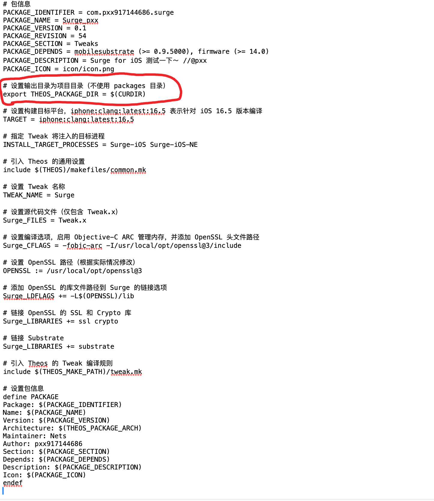
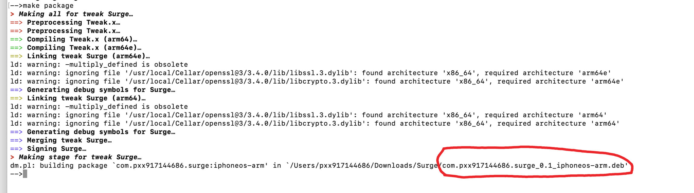
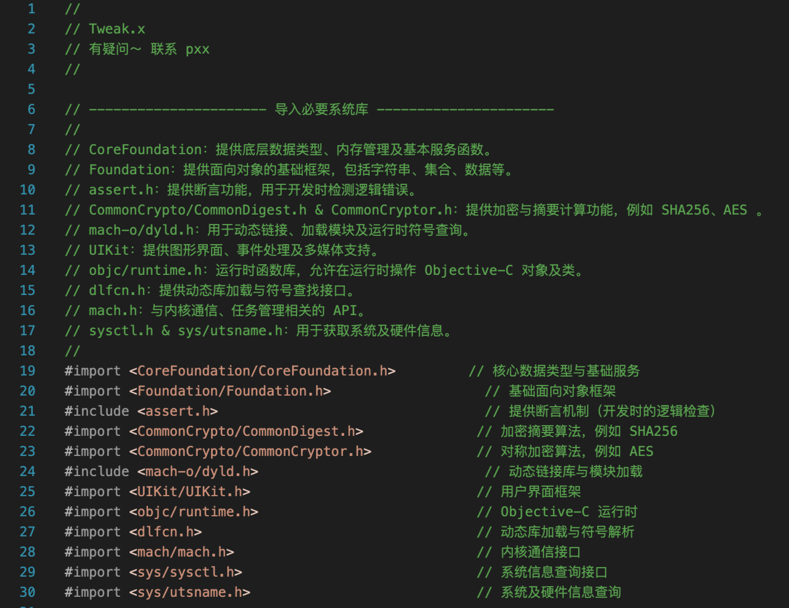

# make文件内容 非常重要



编译插件


打包插件 ——> 到项目根目录



## Surge APP 破解 与 总结
```objc
一. `Surge 验证和管理` 
Surge 使用网络请求定期检查许可证的有效性（refresh 请求）
服务器返回的许可证数据是加密和签名的，需要进行验证。
使用 AES-CBC 加密算法对许可证内容进行解密，密钥和 IV 都是基于设备 ID 的 SHA-256 哈希值。

二. `Surge 定期检查和过期时间判断` 
Surge 使用 fusDate 来判断订阅的过期时间，结合每个功能的 unlockTime 来判断是否解锁该功能。

三. `Surge 析许可证数据`
通过 AES-CBC 解密算法解析许可证数据，进而获取解锁信息。

四. `Surge 验证`
验证确保返回的数据未被篡改，通过内置证书进行校验。
```


## 1.针对 ——> `Surge 验证和管理`
Surge 在执行某些操作时需要验证许可证，特别是加载主界面的 Feature 列表、授权管理、开启 Tunnel 等 UI 操作，以及通过 Timer 定期调用 refresh 接口来检查许可证的有效性。
```objc
1.1 callSurgeLicServer 函数：
callSurgeLicServer 是一个负责向 Surge 许可服务器发送请求的核心函数。这个函数支持的接口包括：

ac（激活接口）

refresh（刷新接口，用于定期检查许可证状态）

activate（激活）

deactivate（停用）

migratev2（迁移）

其中，ac 和 refresh 是周期性调用，用于检查许可是否有效，而其他接口则用于管理许可证的生命周期（如激活、停用等）

```

```objc
1.2 refresh 请求：
refresh 请求会通过 HTTP POST 方法向 Surge 许可服务器发送 JSON 数据，内容包括设备信息、系统版本、设备 ID 等公共参数：

curl --insecure -H 'User-Agent:'  -v -X POST 'https://www.surge-activation.com/ios/v3/refresh' \
    -H 'Content-Type: application/json' \
    -d '{"system":"iOS","build":1966,"bundle":"com.nssurge.inc.surge-ios","deviceName":"iPad","deviceID":"485987D7C875","testflight":true,"systemVersion":"Version 14.2 (Build 18B92)","jailbroken":true,"metadata":{"InitDeviceID":"ADE568FA6F3F"},"deviceModel":"iPad11,4"}'

这些参数用于标识设备并生成设备的许可证验证请求。
```


```objc
1.3 服务器返回的响应：
服务器返回的 JSON 响应包含一个名为 license 的对象，包含了许可证的详细信息：


{
    "license": {
        "policy": "eyJkZXZpY2VJRCI6IjQ4NTk4N0Q3Qzg3NSIsImV4cGlyYXRpb25EYXRlIjoxNjI5NDIwMDgzLCJmdXNEYXRlIjoxNTk2MDIwMjA3LCJ0eXBlIjoibGljZW5zZWQiLCJpc3N1ZURhdGUiOjE2MjgxMjQwODMsInAiOiJlNVBZTm9HOWhLUUhBL0licEtsRzhRPT0ifQ==",

policy 字段是一个 Base64 编码的字符串，包含了许可证的详细信息。这个字段的解码内容包括设备 ID、许可证的过期时间、订阅到期时间等。
```

```objc
        "sign": "Uxv//O3zOFJs40ML1cugN9PAaCqLFxr7y4oi2z4/J7JFFQ1oNkMkYAmu0hroubKQqo7bQL4SbN4zhvFLL//OSScihQrgI6s8JON5QMeE6SRTkKauZdNvxGqQ6DM3KeTW1XTIz/gxGWZRKoUTA2NV2vkF4jZLtA86GvJL+8Iubqx0DGRM11dK+vzYVrYkKqb6qqKvhN9yAFU6Pse00Q7pRJcBb8fzF2Ei4K5OEjUWl1cSRa8wpssCcVr02ckgEsk503w7LpuPlCGbA16JR8RB5VKkuAT3miy7mUdXBckGABlbtkuAiuc/IxZUdV5v3AdtK+KX1JrPNE4f7SlFmDT+9Q=="
    }
}

sign 字段是一个签名，表示许可证内容是经过加密处理的，确保数据未被篡改。
```


```objc
1.4 验证过程：
Surge 会首先验证 sign 字段是否正确？通常，这是通过内置证书来验证签名是否有效。

对比 deviceID： 程序会进一步比对请求中的 deviceID，以确保许可证与当前设备匹配。

获取 expirationDate 和 fusDate：

expirationDate 代表当前请求的许可证过期时间

fusDate 是订阅的过期时间
```


## 2.针对 ——> `Surge 定期检查和过期时间判断`
Surge 通过 fusDate 来判断订阅是否过期` 
每个功能（如 Surge 的某个功能模块或服务）都有一个 unlockTime（解锁时间），当 fusDate 超过这个时间时，功能会被锁定。

fusDate 用于与每个功能模块（FeatureDefine）中的 unlockTime 进行比较。若 fusDate 超过了 unlockTime，则该功能被锁定。


## 3.针对 ——> `Surge 析许可证数据`
使用 AES-CBC 解密 policy 中的数据。解密使用了以下的密钥和初始化向量（IV）：
密钥：SHA256(deviceID)[0:32] ——> 即设备 ID 的 SHA-256 哈希的前 32 字节

IV：SHA256(deviceID)[16:32] ——> 即设备 ID 的 SHA-256 哈希的第 16 到第 32 字节

解密后的内容：
```objc
00000000  03 04 02 4e 53 45 78 74 65 6e 73 69 6f 6e 00
```


## 4.针对 ——> `Surge 验证`

```objc
Hook网络请求
SGNSARequestHelper 
- (id)request:(NSMutableURLRequest *)req completeBlock:(void (^)(NSData *body, NSURLResponse *resp, NSError *err))completeBlock

针对性生成payload
篡改后的License信息

NSDictionary *licInfo = @{
                    @"deviceID": deviceID,
                    @"expirationDate": @4070880000, // 2099-01-01 00:00:00
                    @"fusDate": @4070880000,
                    @"type": @"licensed",
                    @"issueDate": [NSNumber numberWithInt:(long)[[NSDate date] timeIntervalSince1970]],
                    @"p": p,
                };


生成base64

AES_CBC_256(
	input: "\x03\x04\x02NSExtension", 
	key: SHA256(deviceID), 
	iv: SHA256(deviceID)[16:32], 
	options: PKCS7Padding)

最终payload
{"license":{"policy":"base64(licInfo)","sign":""}}


hook 校验函数

EVP_DigestVerifyFinal正好具有极强的pattern可以直接由Lumina识别，直接memmem即可找到对应函数地址，返回1
```


## 关于. `头文件 引入的库 与作用` 



#import <CoreFoundation/CoreFoundation.h>   //Core Foundation 是一个为 Apple 提供的底层框架，包含了大量用于处理基础数据结构（如字符串、日期、集合、数组等）和服务（如内存管理、事件调度等）的 API。

#import <Foundation/Foundation.h>  //Foundation 是 Apple 的另一个重要框架，它提供了很多常用的类和函数，包括字符串处理、集合、文件管理、网络等。

#include <assert.h>  //assert.h 是 C 语言的标准库之一，用于在程序中插入断言。断言是在调试模式下检查条件是否为真，如果为假，程序会停止并报告错误。

#import <CommonCrypto/CommonDigest.h>  //这个头文件引入了 CommonCrypto 库中的加密和哈希功能。CommonCrypto 是 Apple 提供的一个加密库，提供了如 SHA-1、SHA-256、MD5 等常见的哈希算法。

#import <CommonCrypto/CommonCryptor.h>  //这个头文件引入了 CommonCrypto 库中的加密算法功能，提供了加密和解密的 API。

#include <mach-o/dyld.h>  //dyld 是一个用于加载和链接动态库（shared libraries）的库。dyld.h 提供了与动态库加载有关的功能。


## 关于. `NSMutableURLRequest` 

```objc
@implementation NSMutableURLRequest(Curl)

- (NSString *)description {
    __block NSMutableString *displayString = [NSMutableString stringWithFormat:@"curl -v -X %@", self.HTTPMethod];
    
    [displayString appendFormat:@" \'%@\'",  self.URL.absoluteString];
    
    [self.allHTTPHeaderFields enumerateKeysAndObjectsUsingBlock:^(id key, id val, BOOL *stop) {
        [displayString appendFormat:@" -H \'%@: %@\'", key, val];
    }];
    
    if ([self.HTTPMethod isEqualToString:@"POST"] ||
        [self.HTTPMethod isEqualToString:@"PUT"] ||
        [self.HTTPMethod isEqualToString:@"PATCH"]) {
        
        [displayString appendFormat:@" -d \'%@\'",
         [[NSString alloc] initWithData:self.HTTPBody encoding:NSUTF8StringEncoding]];
    }
    
    return displayString;
}

@end

```
作用：这是一个类别（Category），对NSMutableURLRequest类进行了扩展，添加了一个description。通过此方法，可以输出请求的curl命令行表示形式。

## 关于.NSString ：SHA-256 哈希计算
```objc
@implementation NSString (SHA256)

- (NSData *)SHA256 {
    const char *s = [self cStringUsingEncoding:NSUTF8StringEncoding];
    NSData *keyData = [NSData dataWithBytes:s length:strlen(s)];

    uint8_t digest[CC_SHA256_DIGEST_LENGTH] = {0};
    CC_SHA256(keyData.bytes, (CC_LONG)keyData.length, digest);
    NSData *out = [NSData dataWithBytes:digest length:CC_SHA256_DIGEST_LENGTH];
    return out;
}

@end

```
作用：该代码扩展了NSString类，提供了一个SHA256方法来计算字符串的SHA-256哈希值。

## 关于.Hook SGNSARequestHelper
```objc
%hook SGNSARequestHelper 

- (id)request:(NSMutableURLRequest *)req completeBlock:(void (^)(NSData *body, NSURLResponse *resp, NSError *err))completeBlock {
    __auto_type reqRawUrl = [req URL];
    __auto_type reqUrl = [[req URL] absoluteString];
    if (![reqUrl hasPrefix:@"https://www.surge-activation.com/ios/v3/"]) { return %orig; }
    if (!completeBlock) { return %orig; }
    
    __auto_type wrapper = ^(NSError *error, NSDictionary *data) {
        __auto_type resp = [[NSHTTPURLResponse alloc] initWithURL:reqRawUrl statusCode:200 HTTPVersion:@"1.1" headerFields:@{}];
        NSData *body = [NSJSONSerialization dataWithJSONObject:data options:0 error: &error];
        completeBlock(body, resp, error);
    };

    NSLog(@"Surge License Request: %@", [req description]);

    if ([reqUrl hasSuffix:@"refresh"]) { // fake refresh req
        NSError *err = nil;
        NSDictionary *reqDict = [NSJSONSerialization JSONObjectWithData:req.HTTPBody
                                    options:kNilOptions
                                    error:&err];
        NSString *deviceID = reqDict[@"deviceID"];
        __auto_type keydata = [deviceID SHA256];
        const char *keybytes = [keydata bytes];
        char licEncOut[32] = { 0 };
        size_t encRet = 0;
        
        NSLog(@"key: %@ %x", keydata, *(uint32_t *)keybytes);

        CCCrypt(kCCEncrypt, kCCAlgorithmAES, kCCOptionPKCS7Padding, 
            keybytes, 0x20, keybytes + 16, 
            LicEncContent, sizeof(LicEncContent),
            licEncOut, 32, 
            &encRet);
        NSLog(@"encRet: %zu", encRet);

        __auto_type p = [[NSData dataWithBytes:(const void *)licEncOut length:16] base64EncodedStringWithOptions:0];
        NSLog(@"p: %@", p);
        
        [req setURL:[NSURL URLWithString:@"http://127.0.0.1:65536"]];
        void (^handler)(NSError *error, NSDictionary *data) = ^(NSError *error, NSDictionary *data){
            NSDictionary *licInfo = @{
                    @"deviceID": deviceID,
                    @"expirationDate": @4070880000, // 2099-01-01 00:00:00
                    @"fusDate": @4070880000,
                    @"type": @"licensed",
                    @"issueDate": [NSNumber numberWithInt:(long)[[NSDate date] timeIntervalSince1970]],
                    @"p": p,
                };
            NSLog(@"generated licInfo: %@", licInfo);
            NSData *licInfoData = [NSJSONSerialization dataWithJSONObject:licInfo options:0 error: &error];
            NSString *licInfoStr = [[NSString alloc] initWithData:licInfoData encoding:NSUTF8StringEncoding];
            NSLog(@"generated licInfoJson: %@", licInfoStr);

            NSString *licInfoBase64 = [licInfoData base64EncodedStringWithOptions:0];
            wrapper(nil, @{
                @"license": @{
                    @"policy": licInfoBase64,
                    @"sign": @""
                }
            });
        };
        dispatch_async(dispatch_get_main_queue(), ^{
            handler(nil, nil);
        });
    }
    
    if ([reqUrl hasSuffix:@"ac"]) { // disable refresh req
        [req setURL:[NSURL URLWithString:@"http://127.0.0.1:65536"]];
        void (^handler)(NSError *error, NSDictionary *data) = ^(NSError *error, NSDictionary *data){
            wrapper(nil, @{});
        };
        dispatch_async(dispatch_get_main_queue(), ^{
            handler(nil, nil);
        });
    }
    
	return %orig;
}

%end

```
作用：这个部分是对SGNSARequestHelper类的hook。修改了处理请求的方式，修改请求数据或返回虚假的响应。

## 关于.Hook unlockTime
```objc
%hook SGUProFeatureDefine

- (int64_t) unlockTime {
    return 0;
}

%end

```
作用：通过hook修改SGUProFeatureDefine类中的unlockTime方法，使其总是返回0，绕过一些激活或授权检查。

## 关于.OpenSSL签名验证
```objc
void *pEVP_DigestVerifyFinal = NULL;

%hookf(uint64_t, pEVP_DigestVerifyFinal, void *ctx, uint64_t a2, uint64_t a3) {
    %orig;
    NSLog(@"Bypassed surge lic sign check!");
    return 1;
}

```

作用：通过hook一个OpenSSL的EVP_DigestVerifyFinal函数，绕过Surge应用中的license签名验证，直接返回成功。

## 关于.动态加载和查找OpenSSL
```objc
%ctor {
    NSString *execPath = [[NSBundle mainBundle] executablePath].stringByDeletingLastPathComponent;
    while ([execPath containsString:@"/PlugIns"]) {
        execPath = execPath.stringByDeletingLastPathComponent;
    }
    NSString *openSSLPath = [NSString stringWithFormat:@"%@/%@", execPath, @"Frameworks/OpenSSL.framework/OpenSSL"];
    NSLog(@"OpenSSL Framework: %@", openSSLPath);
    if (![[NSFileManager defaultManager] fileExistsAtPath:openSSLPath]) {
        // Static OpenSSL version (<= 4.13.0)
        NSLog(@"Retriving EVP_DigestVerifyFinal using pattern because there's no OpenSSL framework");
        unsigned char needle[] = "\xff\x83\x02\xd1\xf8\x5f\x06\xa9\xf6\x57\x07\xa9\xf4\x4f\x08\xa9\xfd\x7b\x09\xa9\xfd\x43\x02\x91\xf3\x03\x02\xaa\xf4\x03\x01\xaa\xf5\x03\x00\xaa"; // Surge5
        int needleOffset = 0;
        ...
    } else {
        NSLog(@"OpenSSL framework exists!");
        void *ret = dlopen([openSSLPath UTF8String], RTLD_NOW | RTLD_GLOBAL);
        NSLog(@"OpenSSL framework load result: %p", ret);

        MSImageRef image = MSGetImageByName([openSSLPath UTF8String]);
        NSLog(@"Retriving EVP_DigestVerifyFinal using symbol because there's OpenSSL framework: %p", image);
        pEVP_DigestVerifyFinal = MSFindSymbol(image, "_EVP_DigestVerifyFinal");
    }
    NSLog(@"Got EVP_DigestVerifyFinal: %p", pEVP_DigestVerifyFinal);

    %init;
}

```
作用：动态加载OpenSSL库并获取特定函数（比如 EVP_DigestVerifyFinal）的地址，以便于对应用程序进行进一步修改，绕过加密验证。


<details>
<summary> ——> 完整代码如下</summary>

```objc

#import <CoreFoundation/CoreFoundation.h>
#import <Foundation/Foundation.h>
#include <assert.h>
#import <CommonCrypto/CommonDigest.h>  // 引入CommonCrypto库，提供加密功能
#import <CommonCrypto/CommonCryptor.h>  // 引入CommonCrypto库，提供加密算法
#include <mach-o/dyld.h>  // 引入dyld库，用于动态链接和加载

// 扩展NSMutableURLRequest类，添加curl请求的打印功能
@implementation NSMutableURLRequest(Curl)

- (NSString *)description {  // 重写description方法，用于输出请求的curl命令
    __block NSMutableString *displayString = [NSMutableString stringWithFormat:@"curl -v -X %@", self.HTTPMethod];  // 初始化curl命令，设置请求方法
    
    [displayString appendFormat:@" \'%@\'",  self.URL.absoluteString];  // 添加URL到命令
    
    [self.allHTTPHeaderFields enumerateKeysAndObjectsUsingBlock:^(id key, id val, BOOL *stop) {  // 遍历请求头
        [displayString appendFormat:@" -H \'%@: %@\'", key, val];  // 格式化请求头并添加到命令
    }];
    
    if ([self.HTTPMethod isEqualToString:@"POST"] ||
        [self.HTTPMethod isEqualToString:@"PUT"] ||
        [self.HTTPMethod isEqualToString:@"PATCH"]) {  // 如果请求方法是POST、PUT或PATCH
        [displayString appendFormat:@" -d \'%@\'",  // 添加请求体内容
         [[NSString alloc] initWithData:self.HTTPBody encoding:NSUTF8StringEncoding]];  // 将请求体数据转为字符串
    }
    
    return displayString;  // 返回完整的curl命令字符串
}

@end


// 扩展NSString类，提供SHA-256哈希计算功能
@implementation NSString (SHA256)

- (NSData *)SHA256 {  // 添加SHA256计算方法
    const char *s = [self cStringUsingEncoding:NSUTF8StringEncoding];  // 将NSString转换为C字符串
    NSData *keyData = [NSData dataWithBytes:s length:strlen(s)];  // 将C字符串转换为NSData对象

    uint8_t digest[CC_SHA256_DIGEST_LENGTH] = {0};  // 定义一个缓冲区来存放SHA256的结果
    CC_SHA256(keyData.bytes, (CC_LONG)keyData.length, digest);  // 计算SHA256哈希
    NSData *out = [NSData dataWithBytes:digest length:CC_SHA256_DIGEST_LENGTH];  // 将哈希结果转换为NSData
    return out;  // 返回SHA256结果
}

@end


// 定义许可证加密内容
char LicEncContent[] = "\x03\x04\x02NSExtension";  // 这个是许可证加密内容的字节数组

// Hook SGNSARequestHelper类
%hook SGNSARequestHelper 

// Hook方法，拦截request请求，修改请求行为
- (id)request:(NSMutableURLRequest *)req completeBlock:(void (^)(NSData *body, NSURLResponse *resp, NSError *err))completeBlock {
    __auto_type reqRawUrl = [req URL];  // 获取请求的原始URL
    __auto_type reqUrl = [[req URL] absoluteString];  // 获取URL的绝对字符串形式
    if (![reqUrl hasPrefix:@"https://www.surge-activation.com/ios/v3/"]) { return %orig; }  // 如果请求URL不符合特定前缀，调用原始方法
    if (!completeBlock) { return %orig; }  // 如果没有完成回调，调用原始方法
    
    __auto_type wrapper = ^(NSError *error, NSDictionary *data) {  // 创建一个回调包装器
        __auto_type resp = [[NSHTTPURLResponse alloc] initWithURL:reqRawUrl statusCode:200 HTTPVersion:@"1.1" headerFields:@{}];  // 构造一个假的HTTP响应
        NSData *body = [NSJSONSerialization dataWithJSONObject:data options:0 error: &error];  // 将数据转为JSON格式
        completeBlock(body, resp, error);  // 调用完成回调
    };

    NSLog(@"Surge License Request: %@", [req description]);  // 打印请求信息

    if ([reqUrl hasSuffix:@"refresh"]) {  // 如果请求是"refresh"类型，模拟许可证请求
        NSError *err = nil;
        NSDictionary *reqDict = [NSJSONSerialization JSONObjectWithData:req.HTTPBody options:kNilOptions error:&err];  // 解析请求体
        NSString *deviceID = reqDict[@"deviceID"];  // 获取设备ID
        __auto_type keydata = [deviceID SHA256];  // 对设备ID进行SHA256哈希处理
        const char *keybytes = [keydata bytes];  // 获取哈希结果的字节数组
        char licEncOut[32] = { 0 };  // 定义加密输出缓冲区
        size_t encRet = 0;  // 加密结果的大小
        
        NSLog(@"key: %@ %x", keydata, *(uint32_t *)keybytes);  // 打印密钥信息

        // 使用AES加密算法对许可证内容进行加密
        CCCrypt(kCCEncrypt, kCCAlgorithmAES, kCCOptionPKCS7Padding, 
            keybytes, 0x20, keybytes + 16, 
            LicEncContent, sizeof(LicEncContent),
            licEncOut, 32, 
            &encRet);  // 加密过程
        NSLog(@"encRet: %zu", encRet);  // 打印加密结果的大小

        __auto_type p = [[NSData dataWithBytes:(const void *)licEncOut length:16] base64EncodedStringWithOptions:0];  // 将加密结果转为Base64字符串
        NSLog(@"p: %@", p);  // 打印加密后的Base64字符串
        
        [req setURL:[NSURL URLWithString:@"http://127.0.0.1:65536"]];  // 修改请求的URL为本地地址
        void (^handler)(NSError *error, NSDictionary *data) = ^(NSError *error, NSDictionary *data){  // 定义回调处理
            NSDictionary *licInfo = @{  // 构造许可证信息字典
                    @"deviceID": deviceID,
                    @"expirationDate": @4070880000, // 设置过期时间为2099年
                    @"fusDate": @4070880000,  // 设置fusDate为2099年
                    @"type": @"licensed",  // 设置许可证类型为licensed
                    @"issueDate": [NSNumber numberWithInt:(long)[[NSDate date] timeIntervalSince1970]],  // 设置当前时间为颁发日期
                    @"p": p,  // 添加Base64加密字符串
                };
            NSLog(@"generated licInfo: %@", licInfo);  // 打印生成的许可证信息
            NSData *licInfoData = [NSJSONSerialization dataWithJSONObject:licInfo options:0 error: &error];  // 将许可证信息转为JSON数据
            NSString *licInfoStr = [[NSString alloc] initWithData:licInfoData encoding:NSUTF8StringEncoding];  // 将JSON数据转为字符串
            NSLog(@"generated licInfoJson: %@", licInfoStr);  // 打印许可证信息的JSON字符串

            NSString *licInfoBase64 = [licInfoData base64EncodedStringWithOptions:0];  // 将许可证信息的JSON数据转为Base64字符串
            wrapper(nil, @{  // 通过回调返回许可证信息
                @"license": @{
                    @"policy": licInfoBase64,  // 包含Base64编码的许可证信息
                    @"sign": @""  // 空签名
                }
            });
        };
        dispatch_async(dispatch_get_main_queue(), ^{
            handler(nil, nil);  // 在主线程上调用回调
        });
    }
    
    if ([reqUrl hasSuffix:@"ac"]) {  // 如果请求是"ac"类型，禁用刷新请求
        [req setURL:[NSURL URLWithString:@"http://127.0.0.1:65536"]];  // 将请求的URL修改为本地地址
        void (^handler)(NSError *error, NSDictionary *data) = ^(NSError *error, NSDictionary *data){
            wrapper(nil, @{});  // 通过回调返回空数据
        };
        dispatch_async(dispatch_get_main_queue(), ^{
            handler(nil, nil);  // 在主线程上调用回调
        });
    }
    
    return %orig;  // 调用原始的方法
}

%end


// Hook SGUProFeatureDefine类，修改解锁时间
%hook SGUProFeatureDefine

- (int64_t) unlockTime {  // 修改解锁时间方法
    return 0;  // 始终返回0，表示永不过期
}

%end


// 绕过OpenSSL的签名验证
void *pEVP_DigestVerifyFinal = NULL;

%hookf(uint64_t, pEVP_DigestVerifyFinal, void *ctx, uint64_t a2, uint64_t a3) {
    %orig;  // 调用原始方法
    NSLog(@"Bypassed surge lic sign check!");  // 打印绕过日志
    return 1;  // 返回1，表示验证成功，绕过签名检查
}

#include <dlfcn.h>

%ctor {
    // 在Surge >= v4.14.0版本中，OpenSSL不再静态链接
    
    NSString *execPath = [[NSBundle mainBundle] executablePath].stringByDeletingLastPathComponent;  // 获取可执行文件的路径
    while ([execPath containsString:@"/PlugIns"]) {
        execPath = execPath.stringByDeletingLastPathComponent;  // 移除插件路径
    }
    NSString *openSSLPath = [NSString stringWithFormat:@"%@/%@", execPath, @"Frameworks/OpenSSL.framework/OpenSSL"];  // 拼接OpenSSL框架路径
    NSLog(@"OpenSSL Framework: %@", openSSLPath);  // 打印OpenSSL路径
    if (![[NSFileManager defaultManager] fileExistsAtPath:openSSLPath]) {  // 如果OpenSSL框架不存在
        // 如果没有OpenSSL框架，使用模式查找
        NSLog(@"Retriving EVP_DigestVerifyFinal using pattern because there's no OpenSSL framework");
        unsigned char needle[] = "\xff\x83\x02\xd1\xf8\x5f\x06\xa9\xf6\x57\x07\xa9\xf4\x4f\x08\xa9\xfd\x7b\x09\xa9\xfd\x43\x02\x91\xf3\x03\x02\xaa\xf4\x03\x01\xaa\xf5\x03\x00\xaa";  // Surge5版本的特征字节
        int needleOffset = 0;  // 偏移量
        
        int imgIndex = -1;  // 图片索引初始化为-1
        const char surgeImagePath[] = "/private/var/containers/Bundle/Application";  // Surge主程序路径
        for (int i = 0; i < _dyld_image_count(); i++) {  // 遍历已加载的动态库
            NSLog(@"Finding Surge module: %s", _dyld_get_image_name(i));  // 打印正在查找的模块名称
            if (!strncmp(_dyld_get_image_name(i), surgeImagePath, sizeof(surgeImagePath)-1)) {
                imgIndex = i;  // 找到Surge模块
                break;
            }
        }
        if (imgIndex == -1) {  // 如果没有找到Surge模块
            NSLog(@"Cannot find surge main executable under %s", surgeImagePath);
            exit(1);  // 退出程序
        }
        NSLog(@"Got Surge module at index %d: %s", imgIndex, _dyld_get_image_name(imgIndex));  // 打印找到的Surge模块信息
        intptr_t imgBase = (intptr_t)_dyld_get_image_vmaddr_slide(imgIndex) + 0x100000000LL;  // 获取模块的基地址
        intptr_t imgBase2 = (intptr_t)_dyld_get_image_header(imgIndex);  // 获取模块头地址
        NSLog(@"Surge image base at %p %p (%s)", (void *)imgBase, (void *)imgBase2, _dyld_get_image_name(imgIndex));  // 打印模块的基地址
        imgBase = imgBase2;  // 使用第二个基地址
        
        // 寻找特定字节序列的位置
        char *pNeedle = (char *)memmem((void *)imgBase, 0x400000, needle, sizeof(needle) - 1);  
        NSLog(@"found pNeedle at %p", pNeedle);  // 打印字节序列的位置
        if(pNeedle == NULL) {  // 如果没有找到字节序列
            exit(1);  // 退出程序
        }
        pEVP_DigestVerifyFinal = pNeedle + needleOffset;  // 将找到的字节地址存入pEVP_DigestVerifyFinal
    } else {  // 如果OpenSSL框架存在
        NSLog(@"OpenSSL framework exists!");  // 打印框架存在的日志
        void *ret = dlopen([openSSLPath UTF8String], RTLD_NOW | RTLD_GLOBAL);  // 动态加载OpenSSL库
        NSLog(@"OpenSSL framework load result: %p", ret);  // 打印加载结果

        MSImageRef image = MSGetImageByName([openSSLPath UTF8String]);  // 获取OpenSSL的动态库
        NSLog(@"Retriving EVP_DigestVerifyFinal using symbol because there's OpenSSL framework: %p", image);  // 打印获取EVP_DigestVerifyFinal符号的过程
        pEVP_DigestVerifyFinal = MSFindSymbol(image, "_EVP_DigestVerifyFinal");  // 查找EVP_DigestVerifyFinal符号
    }
    NSLog(@"Got EVP_DigestVerifyFinal: %p", pEVP_DigestVerifyFinal);  // 打印获取到的EVP_DigestVerifyFinal地址

    %init;  // 完成初始化
}

```
